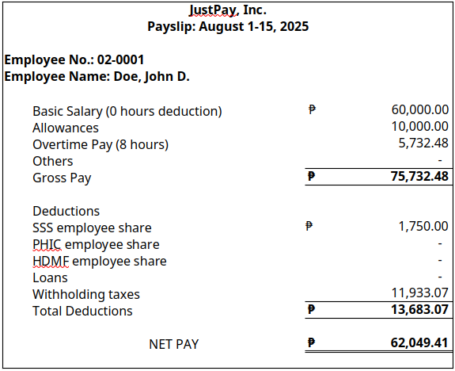

# 👤 Employee Management Module

### Features
- Add/Edit/Delete employee profiles  

---

## Fields

### 1. Full Name
- Format: **Last Name, First Name, Middle Name**

### 2. Employee ID
Employee ID format depends on department:

| Department   | Starting Digits | Format Example | Purpose of Format                          |
|--------------|-----------------|----------------|--------------------------------------------|
| HR           | 1               | 01-0001        | Easy identifier and aids in budget monitoring |
| Finance      | 2               | 02-0001        |                                            |
| IT           | 3               | 03-0001        |                                            |
| Operations   | 4               | 04-0001        |                                            |
| Sales        | 5               | 05-0001        |                                            |
| Marketing    | 6               | 06-0001        |                                            |
| Admin        | 7               | 07-0001        |                                            |
| Legal        | 8               | 08-0001        |                                            |
| Engineering  | 9               | 09-0001        |                                            |

---

### 3. Department
(See above list)

### 4. Position
- Example: **Cost Manager, Finance Associate**

### 5. Job Level

| Level           | Description                                                               |
|-----------------|---------------------------------------------------------------------------|
| Rank-and-File   | Non-supervisory roles (e.g., clerks, assistants, technicians)             |
| Supervisory     | Oversees staff but reports to managers (e.g., team leads, supervisors)    |
| Managerial      | Manages teams, departments, or functions (e.g., HR Manager, Sales Manager)|
| Executive       | Top leadership (e.g., CEO, CFO, CTO)                                      |
| Board/Ownership | Owners, board of directors – may or may not be salaried employees         |

---

### 6. Status

| Employment Status | Description                                      | Sick Leave                  | Vacation Leave          | Medical Insurance / HMO  | SSS           | PHIC                                  | HDMF                           | Tax Notes |
|-------------------|--------------------------------------------------|------------                 |----------------         |--------------------------|---------------|--------------------------------------|--------------------------------|-----------|
| Regular           | Full-time, permanent employee                    | 10 days/yr (non-cumulative) | 10 days/yr (cumulative) | Yes                      | Refer to table| Employee: 2.5% of basic salary<br>Employer: 2.5% | Employee: ₱200<br>Employer: ₱200 | see formula below |
| Probationary      | Trial up to 6 months → becomes regular            | Not entitled               | Not entitled            | No until regular         | Refer to table| Employee: 2.5% of basic salary<br>Employer: 2.5%  |  Employee: ₱200<br>Employer: ₱200  | see formula below |
| Contractual       | Hired for specific duration or project            | Not entitled               | Not entitled            | Not entitled             | Optional      | Optional | Optional | N/A |
| Project-Based     | Ends when project concludes                       | Not entitled               | Not entitled            | Not entitled             | Optional      | Optional | Optional | N/A |
| Seasonal          | Hired only during specific seasons                | Not entitled               | Not entitled            | Not entitled             | Optional      | Optional | Optional | N/A |
| Casual            | Short-term, non-core tasks                        | Not entitled               | Not entitled            | Not entitled             | Optional      | Optional | Optional | N/A |
| Part-Time         | Works less than full workweek                     | Not entitled               | Not entitled            | Not entitled             | N/A           | N/A | N/A | N/A |
| Intern/OJT        | Student trainee                                   | Not entitled               | Not entitled            | Not entitled             | N/A           | N/A | N/A | N/A |
| Consultant        | Specialized expertise                             | Not entitled               | Not entitled            | Optional                 | N/A           | N/A | N/A | If the gross income for the current year did not exceed ₱ 3M = 5% of the professional fees. if gross income is more than ₱ 3M or VAT registered regardless of amount = 10% of the professional fees |                        

> **Tax Formula for Regular Employees**  
> ```
> =IF(A1<=10417, 0, 
>    IF(A1<=16666, (A1 - 10417) * 0.15, 
>    IF(A1<=33332, 937.5 + (A1 - 16667) * 0.2,  
>    IF(A1<=83332, 4270.7 + (A1 - 33333) * 0.25,  
>    IF(A1<=333332, 16770.7 + (A1 - 83333) * 0.3,  
>    91770.7 + (A1 - 333333) * 0.35)))))  
> ```
> Where `A1 = Taxable Income`  
> `Taxable Income = Net Basic Salary + Overtime Pay + Taxable Adjustments - De Minimis Allowances - (SSS + PHIC + HDMF employee share)`  
> `Net Basic Salary = Basic Salary - (Tardiness + Absences + Undertime)`

---

### 7–16. Other Employee Fields
- **Date Hired**  
- **Date of Separation** (if resigned/terminated/retired)  
- **SSS No.**  
- **PhilHealth No.**  
- **HDMF No.**  
- **TIN**
- **Monthly Basic Salary**  
- **Monthly Allowances**  
- **Personal Email Address**  
- **Personal Mobile Number**  
- **Active/Inactive toggle button** (determines payroll inclusion)  
- **Emergency Contact**:  
  - Name  
  - Relation  
  - Contact Address  
  - Contact No.  

---

### 17. Loan Ledger

| Loan Type Options         |
|---------------------------|
| HDMF Salary Loan          |
| HDMF Housing Loan         |
| HDMF Calamity Loan        |
| SSS Salary Loan           |
| SSS Calamity Loan         |
| Personal Cash Advance     |
| Others                    |

Additional fields:
- Principal Amount  
- Loan Date  
- No. of Amortizations  
- Deduction per Payroll = `Principal / No. of Amortizations`  
- Check button for deduction timing (**1st half and/or 2nd half payroll**)  
- Button to indicate **Process/Unprocess** 

### 18. File Attachment
- Employee Contracts
- Offer sheets

# 📅 Attendance Tracking Module

> Integration with time-in/out logs (via **CSV upload** or **API**)  
> Payroll officer may also manually compute, determine, or edit overtime, tardiness, and absences based on printed time logs and company policies.

### Computations (by the hour)
1. **Tardiness** (Late minutes)  
2. **Absences**  
3. **Undertime**  
4. **Overtime**  

# 💵 Payroll Computation Module

### Payroll Periods
Fill out:  
- **Month and Year**  
- **Payroll Period**: 1st half or 2nd half of the month  

---

### Net Pay Formula

**Net Pay =**  
+ Basic Salary = (Monthly Basic Salary / 2)  
- Tardiness, Absences, and/or Undertime Deduction  
+ Allowance = (Monthly Allowance / 2)  
+ Overtime Pay  
+ Adjustments (taxable or non-taxable; e.g., per diem, prior period adjustments)  
- SSS Employee Contribution *(deducted 1st half only)*  
- PHIC Employee Contribution *(deducted 2nd half only)*  
- HDMF Employee Contribution *(deducted 2nd half only)*  
- Loan Deductions  
- Withholding Tax *(based on employment status & taxable income)*  
- Other Adjustments (e.g., mobile charges, prior period adjustments)  

---

### Overtime Pay Rates

| Type                       | Premium Rate              |
|----------------------------|---------------------------|
| Regular                    | 125% of hourly rate       |
| Rest Day                   | 130% of hourly rate       |
| Rest Day (Beyond 8 hours)  | 169% of hourly rate       |
| Legal Holiday              | 200% of hourly rate       |
| Legal Holiday (Beyond 8h)  | 260% of hourly rate       |
| Special Holiday            | 130% of hourly rate       |
| Special Holiday (Beyond 8h)| 169% of hourly rate       |
| Rest Day + Legal Holiday   | 260% of hourly rate       |
| Rest Day + Special Holiday | 338% of hourly rate       |
| Night Shift Differential   | 10% of hourly rate        |

---

### Deduction for Tardiness, Absences, and Undertime
Formula:  
No. of hours tardy/absent/undertime × Personnel Hourly Rate
Where: Personnel Hourly Rate = (Monthly Basic Salary × 12) / 314 days / 8 hours

---

### Payroll Register Features

**Illustration 1**  
Company: JustPay, Inc.  
Payroll Period: **August 1–15, 2025 (1st Half)**  
Date Processed: **August 12, 2025**

| Employee No. | Employee Name          | Department | Basic Salary | Allowance | Overtime Pay | Adjustments | Gross Income | SSS Premium | PHIC Premium | HDMF Premium | Loans | Withholding Taxes | Total Deductions | Net Pay   | 
|--------------|------------------------|------------|--------------|-----------|--------------|-------------|--------------|-------------|--------------|--------------|-------|------------------|------------------|----------|
| 02-0001      | Doe, John  D.| Finance    | 60,000.00    | 10,000.00 | 5,732.48     | -           | 75,732.48    | 1,750.00    | -            | -            | -     | 11,933.07        | 13,683.07        | 62,049.41 |
| 02-0002      | Doe, Jane F.| Finance | 40,000.00    | 2,500.00  | -            | -           | 42,500.00    | 1,750.00    | -            | -            | -     | 5,499.95         | 7,249.95         | 35,250.05 | 

---

**Illustration 2**  
Company: JustPay, Inc.  
Payroll Period: **August 16–31, 2025 (2nd Half)**  
Date Processed: **August 27, 2025**

| Employee No. | Employee Name          | Department | Basic Salary | Allowance | Overtime Pay | Adjustments | Gross Income | SSS Premium | PHIC Premium | HDMF Premium | Loans | Withholding Taxes | Total Deductions | Net Pay   |
|--------------|------------------------|------------|--------------|-----------|--------------|-------------|--------------|-------------|--------------|--------------|-------|------------------|------------------|----------|
| 02-0001      | Doe, John D.| Finance    | 60,000.00    | 10,000.00 | 9,171.97     | -           | 79,171.97    | -           | 2,500.00     | 200.00       | -     | 12,555.44        | 15,255.44        | 63,916.53 | 
| 02-0002      | Doe, Jane F.| Finance | 40,000.00    | 2,500.00  | -            | -           | 42,500.00    | -           | 2,000.00     | 200.00       | -     | 5,387.45         | 7,587.45         | 34,912.55 | 

---

### Developer Note
> In the computation logic, the payroll officer should only need to **input the number of hours** (tardiness, absences, overtime). The payroll system will **automatically compute the monetary equivalents** and reflect them in the payroll register.

---

### Taxable Income Formula
= F125 + H125 + I125 - K125 - L125 - M125
*(where columns reference payroll register fields)*  

---

# 🧾 **Payslip Generation Module**

- Auto-generate payslips by capturing data from each payroll register  
- Payroll Officer can generate them into one file (scroll through and print all) or select only one particular personnel  
- Clickable fields:  
  - **Payroll Period** → Example: August 1–15, 2025 (1st Half)  
  - **Employee Name** → Example: *Doe, John D.* (can be left blank to generate for all personnel)  

### Payslip Illustration



- Output formats: **PDF** and **Excel**  
- Can be emailed directly to personnel or printed  

---

# 📊 **Reports & Logs Module**

- Payroll Registers  
- Payroll Journal Entries for each payroll period  
- Government Remittance Reports:  
  - SSS Premium  
  - PHIC Premium  
  - HDMF Premium  
  - SSS Loans  
  - HDMF Loans  
  - Withholding Taxes  
- Budget Utilization Reports (monitor payroll costs per department)  
- Year-end Benefits Computation:  
  - 13th Month Pay (Net Basic Salary ÷ 12 months)  
  - Monetized Vacation Leave Credits  

---

# ⚙️ **Admin Settings Module**

- Log-in Security  
- User Roles (Admin, HR Staff)  
- Contribution Tables (editable if rates change)  

---